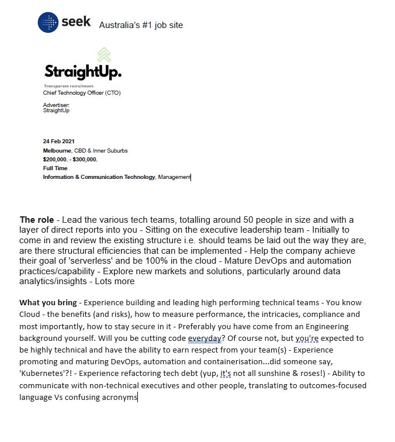
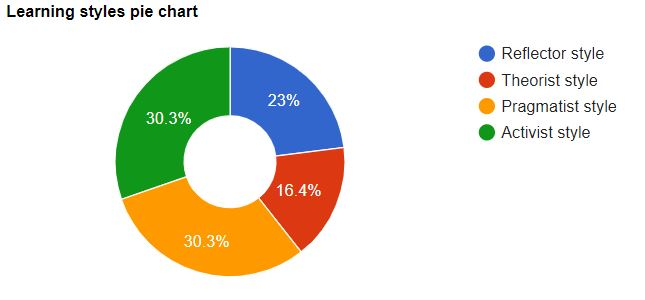
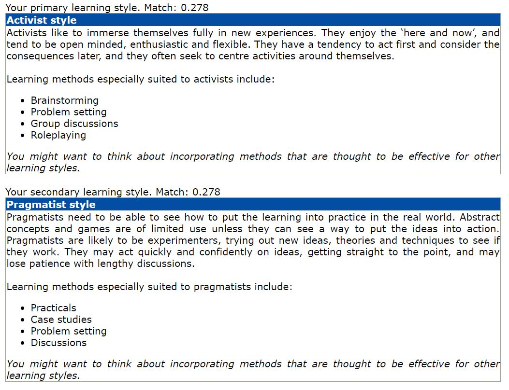
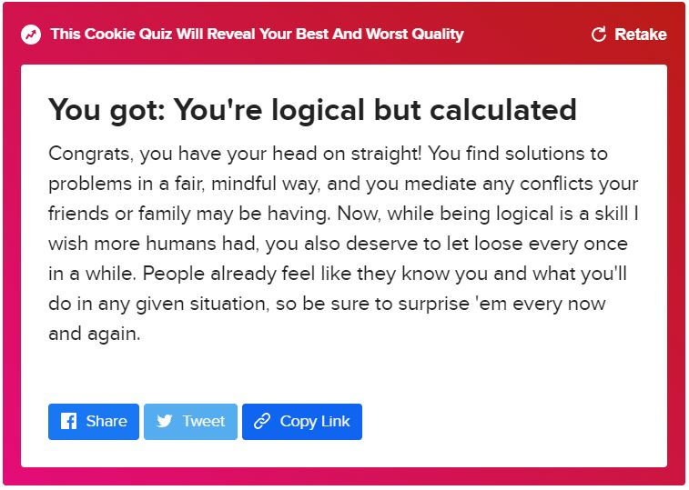

<html>
<head>
<link rel="stylesheet" href="style.css">

<h1>Miles Wilson IT Portfolio</h1>
 
<h3>Sudent Information:</h3>
 
<strong>Name:</strong> Miles Wilson
 
<strong>Student ID:</strong> S3893760
 
<strong>Student Email:</strong> <a href="mailto:S3893760@student.rmit.edu.au">S3893760@student.rmit.edu.au</a>
 
<strong>Personal Email:</strong> <a href="mailto:mileswilson84@outlook.com">mileswilson84@outlook.com</a>
 
<strong>GitHub Links:</strong>
 
<a href="https://github.com/Escape4rtist" target="_blank">My Github</a>
 
<a href="https://github.com/Escape4rtist?tab=repositories" target="_blank">My Github Repositories</a>
 
<strong>Nationality:</strong>
 
New Zealand born Australian. I have lived in Australia now for longer than I did in New Zealand, so while I have been an Australian citizen for 20 years that doesn’t mean I don’t have a special place in my heart for NZ.
 
<strong>Prior Education:</strong>
 
Year 12 Benowa high school, Benowa, Gold Coast, Queensland, Australia.
 
<strong>Languages Spoken:</strong>
 
English, but can say a few phrases in a few languages including Polish, German, French and Japanese.
 
<strong>Fun Fact:</strong> 
I have heterochromia so my eyes are different colours! This means I look a little like a husky with my left eye being blue and my right one being brown. I assure you I’m a human.

<h3>  Interest in IT: </h3>
It all started when I was around 9 or 10 in the mid 1990’s. My dad started using a PC for his work as a journalist, he had been using typewriters prior to that. He was issued a very early Toshiba laptop with a built-in modem that used the phone line. To young me, this was the peak of modern technology in the 1990s. Growing up with movies like Star Wars and TV series like Star Trek and it showed a technological universe that got my young imagination racing, and this laptop was just like something out of the TV. One day, we finally got our own home desktop PC, the humble Intel 386 before eventually upgrading to the DX2 66 486 “Gaming PC” after a few years. My brother and I would battle between each other to play Command and Conquer, Warcraft II and Duke Nukem 3D. We would fight so often I eventually said I would build my own computer and promptly took apart the home PC much to the chagrin of my family who needed it for work. Ever since then I have always loved computers, gadgets and tech (especially that I do not have to share with an older brother!) and I hope to be able to continue to enjoy these things in a professional capacity.

<h3>So, why RMIT?</h3>
I chose RMIT for a few different reasons, I have friends that have attended RIMT and spoken highly of being on campus. When I was looking to study, very few offered part time AND online (I work a fly in fly out roster) so RMIT ticked all the boxes for what I was after. Also, some of the RMIT alumni are interesting folks, Travis Fimmel (Vikings!), Amanda Barnard (I will never understand that much mathematics) and Robert Thomson (CEO of News Corp!) so I would like to be able to add myself to that list.

<h3>What is the plan?</h3>
By the end of my degree, I hope to be able to have a broad but comprehensive understanding of Information Technology so that I can utilise my degree to further my career in a positive and meaningful way. I would love to be able to run my own company or be in a position where I am able to manage others, by being armed with a degree I can show potential employers and employees alike that I understand Information Technology.

<h3>What do I want to do?</h3>
I am very much a people person; I like to see those around me succeed and grow. I am very creative in my head but lack the ability to put the ideas on paper or make them happen how I envision it, so I like to work with many other people to help this happen. My dream would be in a role that sees me and my family travelling internationally, meeting fascinating new people and seeing new technologies and how they are used, all while adding value to the company that I am in, or possibly even my own company
After looking for roles that might suit me, I managed to find a role which is of great interest personally. This role is a Chief Technology Officer working with StraightUp <a href="https://www.seek.com.au/job/51618260/apply" target="_blank">role on Seek.com.au</a>.
 

 
I see this position is one of high-level IT leadership that calls for great people skills. The position will also need a highly technical person, ideally with a bachelor’s but it is more from an understanding of the code more than having to be able to do it (but that will help). The CTO will definitely need viable skills in DevOps and cloud solutions such as AWS and Azure, the latter two are available through online courses. Like anyone in this sort of role being able to work in an Agile environment will be a big plus as well. The team of around 50 people that also includes direct reporting management will likely need management experience. It will need someone who has a finger on the pulse of current technology, especially including Cloud solutions and data analytics. Currently I possess only a latent people skill and management ability, but nothing formal. For me to be able to acquire a role like this I would need to spend a great deal of time learning more about cloud services especially by enrolling in the AWS course via aws.amazon.com/training and similar processes. After having obtained the required certifications then being able to implement those skills to progress and develop a better understanding.

<h3>Personality Type:</h3>

My personality type is <a href="https://www.16personalities.com/enfp-personality" target="_blank">ENFP Personality Type on 16personalities.com</a> which oddly enough has changed, I took the test some years ago and had ENFJ. The ENFP type is suited for many different role types, but one of the main is the Entrepeneur, because of the freedom it affords to manage their own company/lifestyle. It also lends itself very well to positions of leadership and management due to the inherent understanding of people that comes naturally to the Campaigner personality type.

<h3>What does this mean?</h3>
This does rather unfortunately mean that “finding a dream job” is very difficult – you can’t apply for a role; you have to create it. However, that does go against this profile, so in the spirit of the assignment my dream job would be a role in which I am able to manage people and help them develop and succeed.

<h3>Team Influence:</h3>
A hands-on learning style has a few pros and cons in a team environment. Being that my learning type is a more tactile style inherently means I am a more people person (I want to be able to ask for help!). A pro is that I can ask for advice and help as needed from my fellow team members, which helps build rapport and relationships with my co-workers. The con to that is my teammates may not be willing/able to show me and this can easily lead to frustration from both parties, especially if it is something, they feel I “should already know” or have shown before, after all everyone has different learning and teaching styles too.

<h3>So how does this affect forming a team?</h3>
When forming a team, it is ideal to find people of similar learning styles so that we can all bounce off one another. Having a similar style creates an understanding where you teach someone the way you might wish to be taught yourself. That being said, not everyone is the same so when forming a team, I need to remind myself of that, not to get upset if people aren’t able to help or simply don’t want to. All that in mind however it is also good to have a diverse team of different styles to be able to cover all the bases.

<h3>Learning Style:</h3>
I took the learning style test from <a href="http://emtrain.eu/learning-styles" target="_blank">emtrain.eu/learning-styles</a>
 

 

 
<h3>For a bit of fun:</h3>
I took a quiz from Buzzfeed, the <a href="https://www.buzzfeed.com/pablovaldivia/rate-cookie-flavors-quiz" target="_blank">Buzzfeed Cookie Quiz</a> (yes, I know) rating different cookies to see about my personality. I like cookies so it was a no brainer.
 

 

<h2>Project Idea:</h2>
Sunglasses and Smartphone App that detect and warn about UV exposure, with built in audio and safety lenses.
 
<h3>Overview:</h3>
A pair of smart sunglasses that detect exposure to UV radiation and alert the user via an associated Smartphone App, including trends of how much exposure over day/week/month. Sensors would also be able to detect the ambient temperature to offer heat warnings. These glasses would be stylish and comfortable, with an acceptable Ingress Protection rating (IP54) and ANSI Z87.1 rated lenses. The glasses will also make use of bone conduction to allow music and podcasts as well as audible UV/Heat warnings to be played to the wearer. An optional upgrade would also include heart rate and biometric data displayed in a HUD or via the App.
The Motivation: Australia has some of the highest rates of skin cancer in the world*. While we do the Slip Slop Slap Seek Slide, that may not be enough when spending hours on the beach in summer or working out in the field in regional areas. The motivation here is to be able to utilise the Slide – Slide on a pair of sunglasses – with modern smartphone and IoT technology to monitor and warn about exposure time, helping reduce skin cancer rates and keep Aussies (and the world) safer. Additionally, eye protection is of the utmost importance as sight is one of our most valuable senses and most people like to listen to music, so this rolls multiple devices into one.
 
<h3>Description:</h3>
These UV monitoring sunglasses will allow the wearer to see the current exposure to UV radiation and with both audible and smartphone warnings when levels increase. A companion app will be available (at no cost to the user) which will then connect to the glasses for data gathering and compilation as well as real time information regarding the UV exposure and current temperature as well as warnings based on the current time of day. The application will pull data from multiple sources such as weather websites and an in-built UV sensor. By using the app in conjunction with the sunglasses, we can see peak UV exposure times for the day with associated warnings, as well as weekly and monthly overall exposure. Additional data, such as ambient temperature, will be available via the app, including features such as weather forecasts. That information can be used to advise the wearer which times are safer to be in the sun while keeping the UV radiation risk lower. The app will be used in a manner that can be very hands off, which is why the bone conduction is highly valued, for both warnings and entertainment. The glasses will have a rechargeable battery in them, likely a small lithium-ion cell. Preferably a wireless charge system would be implemented but likely USB C for ease of access and reduction of manufacturing costs. The glasses will still function as normal sunglasses without power, of course. As the glasses will have a safety rating in line with industry standards, they will be able to keep the wearers eyes safe from UV and potential injury from airborne objects.
 
<h3>Tools and Tech:</h3>
The application will need to be programmed in a language that can use both Android and iOS. Presently Dart will be the main choice, as it is used in Flutter, which is a Software Development Kit made by Google for creating apps on both platforms. Failing that, the tried-and-true Java which was created in 1996 but remains one of the most used programming languages. The glasses themselves will need to have a UV sensor, like ones used in Arduino kits. A small amount of storage will be needed to hold data if the app is not connected for upload later. The glasses will need to have Bluetooth capabilities, so a small Bluetooth module will be required as well as a lithium-ion battery to power it all. The glasses will also require a circuit board to control everything. Most of this will be able to be build using Dart/Java for the programming language and Arduino for the physical components although that will also need C++. Finally, the lenses need to be durable and protect from UV rays, while the frames will have to be lightweight and not too bulky considering all the components inside.
 
<h3>Skills Required:</h3>
The project will need skilled programmers who are able to code in Java and or Dart for the application side as well as C++ for the hardware. Additionally, it will need engineers who can work with Arduino and similar systems to help build and work on the proof of concept and prototypes. I personally am very interested in Arduino, so will spend time learning more about how to build using that, then learning the network side of Bluetooth technologies. The most beneficial way to have a project like this run will be using an Agile approach so any team you are working in will need to be aware of Agile Methodology, Scrums and Sprints. For the hardware development and construction, the build team will have to liaise with the programmers often so communications software such as MS Teams, or Discord will be required as well as using GitHub to work together while taking care not to damage previous iterations.
 
<h3>Outcome:</h3>
Should this be successful then both the sunglasses and application will be rolled out via a Kickstarter or similar, as well as offered to organisations such as Surf Life Savers, Road workers and even Defence Forces as testers with community feedback. We should be able to see results come in with a reduction in Sun related injuries such as heat stress and severe sunburn. Being able to offer this product to sectors that have high amounts of UV exposure as a workplace hazard, we can gather data to see if there is a positive impact by using this product. Once we have sufficient data, it can be rolled out in conjunction with the Cancer Council of Australia, ideally with some of the proceeds of sales going to help research and development, hopefully leading to a cure in the future.
 

Thank you.
